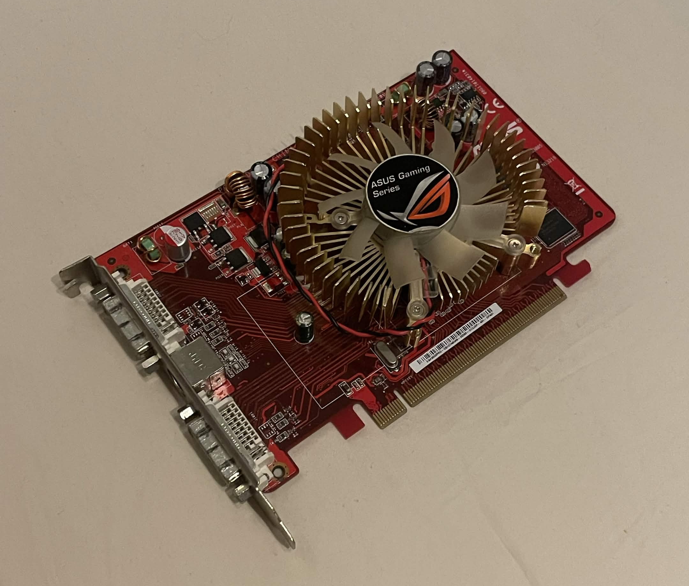

<h1 align="center">RL Render 👾</h1>
<h5><p align="center">A graphics renderer that didn't forget about the past</p></h5>
<p align="center">
    <a href="https://www.techpowerup.com/gpu-specs/ati-radeon-hd-2600-pro-gddr3.b1713">
        
    </a>
    <br>
    <sub><i>ATI Radeon HD 2600 Pro, used for legacy hardware  compatibility testing</i></sub>
</p>

## Features
- **Multiple Backends**<br>
The renderer chooses either ___OpenGL 3.3___ or ___OpenGL ES 3.0___ dynamically at runtime depending on which of these two are supported by the system.
- **Custom Shader Language**<br>
[RLSL](https://github.com/rasu01/rlsl) is a shading language specifically written for RL Render. Since there are multiple backends a custom shader language makes sure a single shader can be used for any backend.
- **MTSDF Fonts**<br>
It is used together with texture atlases generated from [Chlumsky's atlas gen](https://github.com/Chlumsky/msdf-atlas-gen). The engine loads in the .csv file with the glyph data, and then the texture atlas image. It uses [stb image](https://github.com/nothings/stb/blob/master/stb_image.h) to load the image. Only the ___MTSDF___ variant is supported.
- **Texture Atlases**  
Texture atlases can be stitched together automatically by declaring the images in a list. with the help of [stb rect pack](https://github.com/nothings/stb/blob/master/stb_rect_pack.h) and [stb image](https://github.com/nothings/stb/blob/master/stb_image.h) the images will be loaded and inserted into a single texture, whilst also creating texture atlas tile handles into the locations declared in that same list.
- **Texture Compression**  
For textures that hint compression, BC4(R textures), BC5(RG textures), BC1(RGB textures), BC3(RGBA textures) and BC7(RGB or RGBA textures) might be used depending on hardware support to compress the texture. BC1, BC3, BC4 and BC5 use [stb dxt](https://github.com/nothings/stb/blob/master/stb_dxt.h) whilst, [bc7enc](https://github.com/richgel999/bc7enc) is used for BC7. BC7 is prefered, but if the hardware does not support it, BC3 or BC1 will be used. If the graphics card does not support compression at all, the normal uncompressed path will be taken. The textures that are loaded are still loaded with [stb image](https://github.com/nothings/stb/blob/master/stb_image.h) which means that they are compressed at runtime to make asset loading simple. Since texture compression takes time, the final texture is cached and will be loaded from disk the next time it's trying to compress the same texture.
- **GPU Skinning**<br>
The poses of the animations are prebaked and uploaded to the gpu as a texture to make it possible to do gpu skinning. Alternatively, the poses can be preblended on the CPU and uploaded to an UBO buffer before the model is being drawn to avoid texture fetches and blending in the vertex shader.

## Libraries Used
The libraries are mainly single header libraries to try to minimize the complexity at compile time.
- [cgltf](https://github.com/jkuhlmann/cgltf)
- [glad](https://gen.glad.sh/)
- [glfw](https://github.com/glfw/glfw)
- [bc7enc](https://github.com/richgel999/bc7enc)
- [stb_ds.h](https://github.com/nothings/stb/blob/master/stb_ds.h)
- [stb_dxt.h](https://github.com/nothings/stb/blob/master/stb_dxt.h)
- [stb_image.h](https://github.com/nothings/stb/blob/master/stb_image.h)
- [stb_image_resize2.h](https://github.com/nothings/stb/blob/master/stb_image_resize2.h)
- [stb_rect_pack.h](https://github.com/nothings/stb/blob/master/stb_rect_pack.h)
- [rlsl](https://github.com/rasu01/rlsl)
- [rlpp](https://github.com/rasu01/rlpp)

## Dependencies
For a computer to run the renderer an OpenGL 3.3 or OpenGL ES 3.0 compatible graphics card is required.

On linux you need to install some dependencies to build. On a debian based linux distribution, the following command will download all the required packages<br>
```
sudo apt install cmake gcc pkg-config libgl1-mesa-dev libwayland-dev libxrandr-dev libxinerama-dev libxcursor-dev libxi-dev libxkbcommon-dev
```

## How to Build
The library is built with cmake.